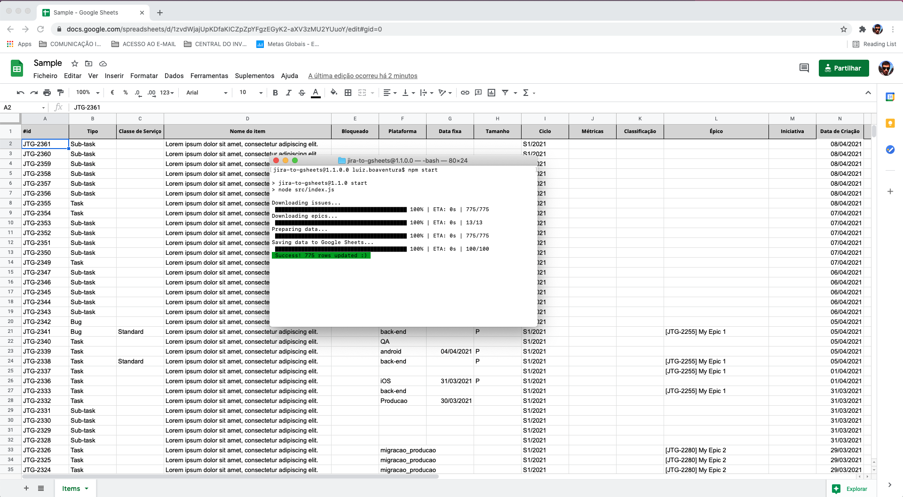

# JIRA to Google Sheets (jira-to-gsheets)
> Extract data from JIRA Cloud and save to Google Sheets.



## Installation

```sh
cd ./path/to/jira-to-gsheets
npm install
```

## Usage example

```sh
npm start
```

## Meta

Luiz Boaventura

Distributed under the MIT license. See ``LICENSE`` for more information.

[https://github.com/luizfbs/jira-to-gsheets](https://github.com/luizfbs/jira-to-gsheets/)

## Contributing

1. Fork it (https://github.com/luizfbs/jira-to-gsheets/fork>)
2. Create your feature branch (`git checkout -b feature/fooBar`)
3. Commit your changes (`git commit -am 'Add some fooBar'`)
4. Push to the branch (`git push origin feature/fooBar`)
5. Create a new Pull Request